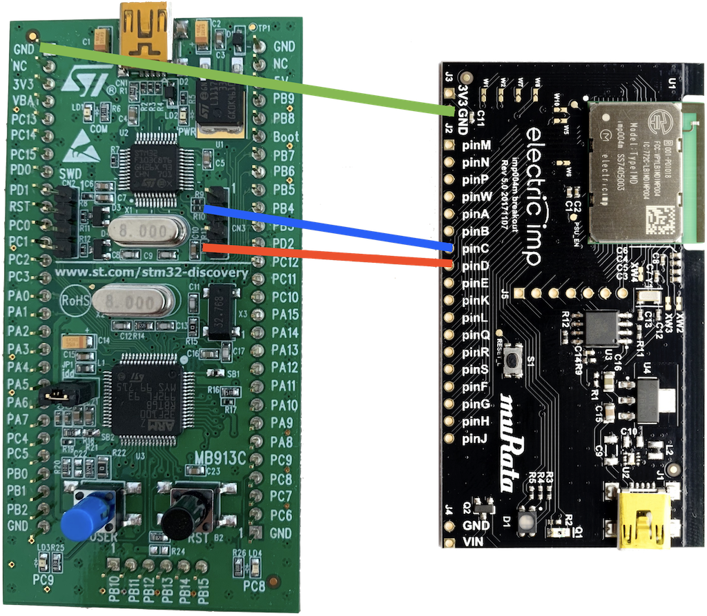
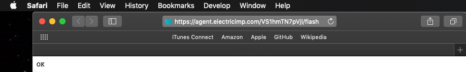

# SWDFlasher-STM32 #

SWDFlasher-STM32 is an imp application that can be used to flash the STM32F100 MCU. It downloads a firmware image via HTTPs, transmits it to the device, which uses the SWD protocol to program the MCU.

## Hardware ##

To make use of SWDFlasher-STM32 you will require:

- An [imp004m Breakout Board](https://store.electricimp.com/products/imp004m-breakout-board?variant=33852062354) or [imp003 Breakout Board](https://store.electricimp.com/products/imp003-breakout-board?variant=31162918482).
- An [STM32VLDISCOVERY](https://www.st.com/en/evaluation-tools/stm32vldiscovery.html) evaluation board.

**Note** Other imp-based hardware may be used but the application has only been tested using the devices listed above. The implementation method applies to any STM32F10xxx MCU but has been tested only with the STM32F100RBT6B (installed on the STM32VLDISCOVERY board).

### Wiring ###

You will need three wires to bridge the following pins on the imp and the STM32F100RBT6B:

| imp | STM32F100RBT6B |
| :-: | :-: |
| GND |GND |
| C | SWCLK |
| D | SWDIO |

On the STM32VLDISCOVERY, remove the jumpers from the CN3 connector of your MCU; the SWCLK and SWDIO are those shown connected to the imp below:



**Note** Almost any GPIO pins can be used on the imp’s side, but you will need to specify your pin choice in the code. Look for the *SWDFSTM32_SWCLK_PIN* and *SWDFSTM32_SWDIO_PIN* constants in [the main device code](./src/device/Main.device.nut) (toward to the top of the listing).

## Setup ##

### Firmware Images ###

SWDFlasher-STM32 requires the URL of a **binary** firmware image.

The URL should be added to the code in the [Main.agent.nut](./src/agent/Main.agent.nut) file (almost at the end of the file):

```squirrel
const IMAGE_URL = "<LINK_TO_YOUR_FIRMWARE_IMAGE>";
```

We have included two simple sample images in the [firmware folder](./firmware/). You can use them to try the code by adding their online locations to the code as shown above. They are made for the STM32VLDISCOVERY board and blink its blue LED. The different versions of the firmware apply different blinking frequencies.

To use one of the sample images you need to obtain a direct link to the files on GitHub:

1. Copy to the clipboard one of the following links: 
    - [blinkFast.bin](./firmware/blinkFast.bin?raw=true)
    - [blinkSlow.bin](./firmware/blinkSlow.bin?raw=true)
1. Paste the link into the code as a value of the *IMAGE_URL* constant as shown in the code snippet above.

#### How To Make A Binary Firmware Image ####

STM32F10xxx firmware images can be provided to you in any of a number of different formats. However, this application **only supports the binary format**. If you have an image in a different format, you will first need to convert it to binary. This can be done using the [*bjcopy* (or *arm-none-eabi-objcopy*)](https://linux.die.net/man/1/objcopy) utility from the [GNU ARM Embedded Toolchain](https://developer.arm.com/open-source/gnu-toolchain/gnu-rm).

For example, the following command:

```bash
arm-none-eabi-objcopy -I ihex your_firmware_image.hex -O binary your_firmware_image.bin
```

converts an image from Intel HEX format to binary.

### Basic HTTP Authentication ###

You may need to use HTTP authentication to download your chosen firmware image. However, this application **only supports Basic HTTP Authentication**. If you can download your chosen firmware image using  Basic HTTP Authentication, add your access details to the *CREDENTIALS* constant in the agent code as follows:

```squirrel
const CREDENTIALS = "<USERNAME>:<PASSWORD>";
```

**Note** If you use the sample firmware from this repository, or firmware from another source which doesn’t require authentication, please leave the constant empty.

## How To Run The Application ##

SWDFlasher-STM32 is provided as a set of multiple files which must be combined before being uploaded to the impCloud™ for deployment to your chosen device group and the device assigned to it. There are two ways to perform this assembly:

- [Manually](#manual-assembly)
- [Using the impWorks™ Sublime Plug-In](#build-and-run-using-sublime)

Once you have built and run the application, please see the [Start Flashing](#start-flashing) section.

### Manual Assembly ###

The application’s source code has the following structure:

- [`src/agent`](./src/agent) &mdash; the agent code.
- [`src/device`](./src/device) &mdash; the device code.
- [`src/shared`](./src/shared) &mdash; code included in both the agent and device code.

To build the project, use [Builder](https://github.com/electricimp/Builder). Just call it for the [Main.agent.nut](./src/agent/Main.agent.nut) and [Main.device.nut](./src/device/Main.device.nut) files. To do so, run these commands from the `src` directory:

```bash
pleasebuild agent/Main.agent.nut > agent.nut
pleasebuild device/Main.device.nut > device.nut
```

You will get two new files &mdash; `agent.nut` and `device.nut` &mdash; which you can then copy into the impCentral™ code editor on either [the AWS impCloud](https://impcentral.electricimp.com/login) or [the Azure impCloud](https://impcentral-azure.electricimp.com/login), depending on which of these impClouds hosts your account and imp hardware. Now run the application.

### Build And Run Using Sublime ###

This application has been written using [Electric Imp’s Sublime Plug-in](https://github.com/electricimp/ElectricImp-Sublime). All configuration settings and pre-processed files have been excluded. If you wish to use this option, follow these steps:

1. Follow [these instructions](https://github.com/electricimp/ElectricImp-Sublime#installation) to install the plug-in and create a project.
2. Replace the `src` folder in your newly created project with the `src` folder found in this repository.
3. Update the `settings/electric-imp.settings` file’s *device-file* and *agent-file* keys to the following (on Windows use `\\` instead of `/`):
```
    "device-file": "src/device/Main.device.nut",
    "agent-file": "src/agent/Main.agent.nut"
```
4. [Build and run the application](https://github.com/electricimp/ElectricImp-Sublime#building-and-running)

## Start Flashing ##

When the application is running, you should make an HTTP GET request to the agent’s `/flash` endpoint to start flashing. Just click on the agent’s URL in the impCentral code editor, then append `/flash` to the URL in the browser link field, and press *Enter*:



This message in the logs states successful flashing: `Flashing finished with status: OK`.

The flashing process may take some time. The speed of flashing is approximately 450 bytes per second (measured during the testing with the STM32VLDISCOVERY). During the process, you should see messages like `Chunk requested/Chunk received` appear in the log. 

## License ##

Code licensed under the [MIT License](./LICENSE).
